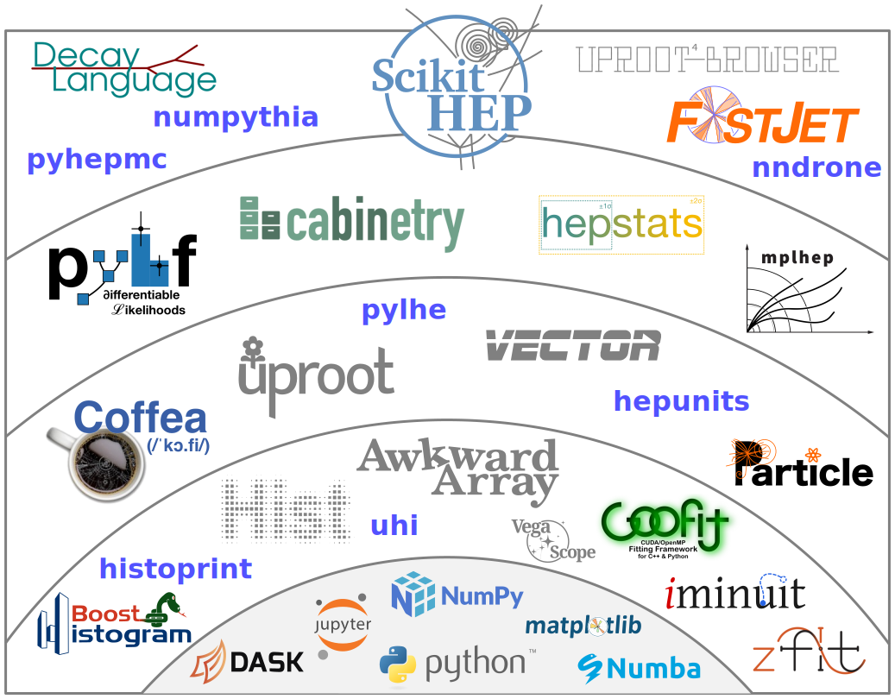
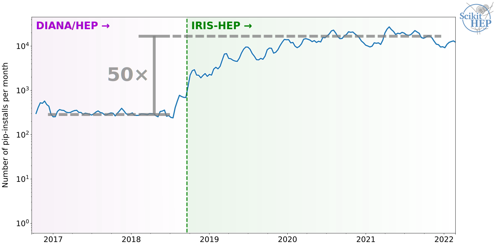
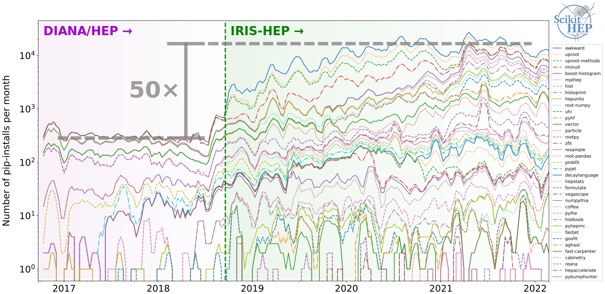
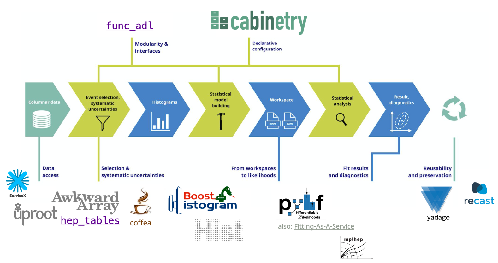
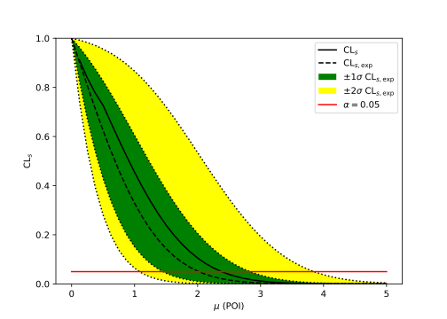

class: middle, center, title-slide
count: false

# Analysis user experience with<br>
# the Python HEP ecosystem

<br>

.huge.blue[Matthew Feickert]&emsp;.huge[Jim Pivarski]
<br>
.huge[(University of Illinois at Urbana-Champaign)]
<br><br>
[matthew.feickert@cern.ch](mailto:matthew.feickert@cern.ch)

[Analysis Ecosystems Workshop 2022](https://indico.cern.ch/event/1125222/contributions/4840334/)

May 23rd, 2022

---
# Info slide (remove before talk)

* Time: .bold[15 minutes] talk + 5 minutes questions
* Concept notes from Alex:
   - Really what it is about is talking about analyzer user experience
   - Briefly talk more generally about the ecosystem
      - not everyone will be very familiar, though participants will get pre-workshop material
   - Future-facing thoughts about ecosystem would also fit well (white paper recommendations)

---
# Ecosystems

.center[
.width-60[[](https://coiled.io/blog/pydata-dask/)]

In his [PyCon 2017 keynote](https://youtu.be/ZyjCqQEUa8o), Jake VanderPlas gave us the iconic "PyData ecosystem" image
]

---
# PyHEP ecosystem

.center[
.width-60[[](https://indico.cern.ch/event/1140031/)]

In his [2022 PyHEP topical meeting update](https://indico.cern.ch/event/1140031/), Jim Pivarski gave us a view for the Scikit-HEP ecosystem
]

---
# PyHEP ecosystem (quick summary)

.kol-1-2.huge[
<ol reversed>
  <li>HEP-specific UI applications or packaged algorithms</li>
  <li>HEP-specific for common problems</li>
  <li>HEP-specific, foundational</li>
  <li>needed to create, but not really HEP-specific</li>
  <li>non-HEP software we depend on</li>
</ol>
]
.kol-1-2[
.center.width-110[[](https://indico.cern.ch/event/1140031/)]
]

---
# Community adoption ...

.center.width-100[[](https://github.com/matthewfeickert/talk-analysis-ecosystems-workshop-2022/issues/1)]

---
# Community adoption with ecosystem growth

.center.width-100[[](https://github.com/matthewfeickert/talk-analysis-ecosystems-workshop-2022/issues/1)]
<!--  -->
.center[Aided by interoperable design]

---
# Interoperability allows for analysis pipelines

.center[
.width-90[[](https://iris-hep.org/as.html)]

See end-to-end analysis demo by Alex Held at [Analysis Grand Challenge Tools Workshop 2022](https://github.com/iris-hep/analysis-grand-challenge/blob/ec5184fb65bdc96a3d8ff1ac00e7fc8a8f399213/analyses/cms-open-data-ttbar/coffea.ipynb)
]

---
# Browser native ecosystem as of April 2022

<iframe
   src="https://jupyterlite.github.io/demo/repl/index.html?kernel=python&toolbar=1&code=import%20micropip%0Aawait%20micropip.install%28%5B%22hist%22%2C%20%22vector%22%2C%20%22mplhep%22%2C%20%22pyhf%22%5D%29%0A%25matplotlib%20inline%0Aimport%20boost_histogram%0Aimport%20hist%0Aimport%20vector%0Aimport%20mplhep%0Aimport%20pyhf"
   width="100%"
   height="500px"
></iframe>

.center[[Pyodide](https://pyodide.org/en/stable/) CPython port to WebAssembly/Emscripten powering [JupyterLite](https://jupyterlite.readthedocs.io/) kernel]

---
# Bolstered by most of PyData/SciPy stack

.kol-1-2.code-tiny[
```python
# one bin example from pyhf v0.6.3 docs
import pyhf
import numpy as np
import matplotlib.pyplot as plt
from pyhf.contrib.viz import brazil

pyhf.set_backend("numpy")
model = pyhf.simplemodels.uncorrelated_background(
    signal=[10.0], bkg=[50.0], bkg_uncertainty=[7.0]
)
data = [55.0] + model.config.auxdata

poi_vals = np.linspace(0, 5, 41)
results = [
    pyhf.infer.hypotest(
        test_poi, data, model, test_stat="qtilde", return_expected_set=True
    )
    for test_poi in poi_vals
]

fig, ax = plt.subplots()
fig.set_size_inches(7, 5)
brazil.plot_results(poi_vals, results, ax=ax);
```
<!--  -->
.center.width-60[[](https://pyhf.readthedocs.io/en/v0.6.3/)]
]
.kol-1-2[
<iframe
   src="https://jupyterlite.github.io/demo/repl/index.html?kernel=python&toolbar=1&code=import%20piplite%0Aawait%20piplite.install%28%5B%22pyhf%3D%3D0.6.3%22%2C%20%22requests%22%5D%29%0A%25matplotlib%20inline%0Aimport%20pyhf"
   width="100%"
   height="500px"
></iframe>
]

---
# Summary
.kol-2-3[
- .large[.bold[Summary point]]
   - backing ideas
]
.kol-1-3[
<br>
<br>
<br>
.center.width-100[[](https://iris-hep.org/)]
]

---
class: end-slide, center

Backup

---
# References

1. Great reference here

---

class: end-slide, center
count: false

The end.
