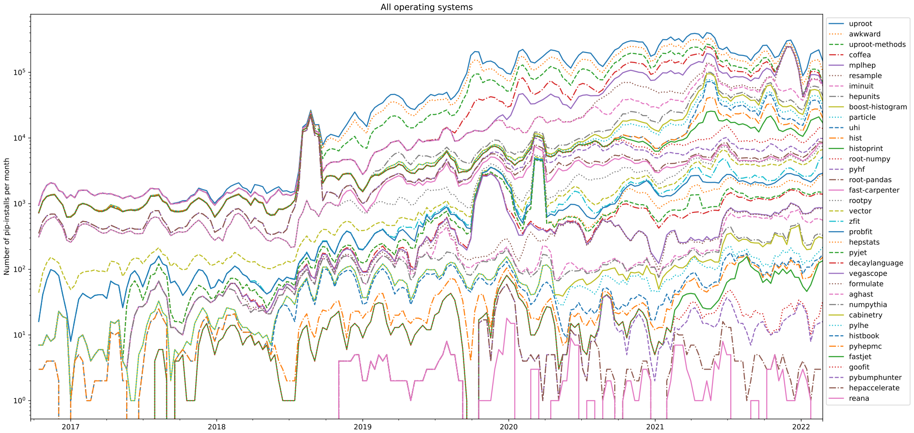

class: middle, center, title-slide
count: false

# HEP Python Ecosystem for Analysis

 

.huge.blue[Matthew Feickert]&emsp;.huge[Jim Pivarski]
 
.huge[(University of Illinois at Urbana-Champaign)]
  
[matthew.feickert@cern.ch](mailto:matthew.feickert@cern.ch)

[Analysis Ecosystems Workshop 2022](https://indico.cern.ch/event/1125222/contributions/4840334/)

May 23rd, 2022

---
# Info slide (remove before talk)

* Time: .bold[15 minutes] talk + 5 minutes questions
* Concept notes from Alex:
   - Really what it is about is talking about analyzer user experience
   - Briefly talk more generally about the ecosystem
      - not everyone will be very familiar, though participants will get pre-workshop material
   - Future-facing thoughts about ecosystem would also fit well (white paper recommendations)

---
# Ecosystems

.center[
.width-60[]

In his [PyCon 2017 keynote](https://youtu.be/ZyjCqQEUa8o), Jake VanderPlas gave us the iconic "PyData ecosystem" image
]

---
# PyHEP ecosystem

.center[
.width-60[]

In his [2022 PyHEP topical meeting update](https://indico.cern.ch/event/1140031/), Jim Pivarski gave us a view for the Scikit-HEP ecosystem
]

---
# PyHEP ecosystem (quick summary)

.kol-1-2.huge[
<ol reversed>
  <li>HEP-specific UI applications or packaged algorithms</li>
  <li>HEP-specific for common problems</li>
  <li>HEP-specific, foundational</li>
  <li>needed to create, but not really HEP-specific</li>
  <li>non-HEP software we depend on</li>
</ol>
]
.kol-1-2[
.center.width-110[]
]

---
# Truly an .huge[ecosystem]

.center[
.width-90[]

Their growth is tightly coupled to the interoperable design [[image](https://indico.cern.ch/event/1140031/): Jim Pivarki]
]

---
# Summary
.kol-2-3[
- .large[.bold[Summary point]]
   - backing ideas
]
.kol-1-3[
 
 
 
.center.width-100[]
]

---
class: end-slide, center

Backup

---
# References

1. Great reference here

---

class: end-slide, center
count: false

The end.
